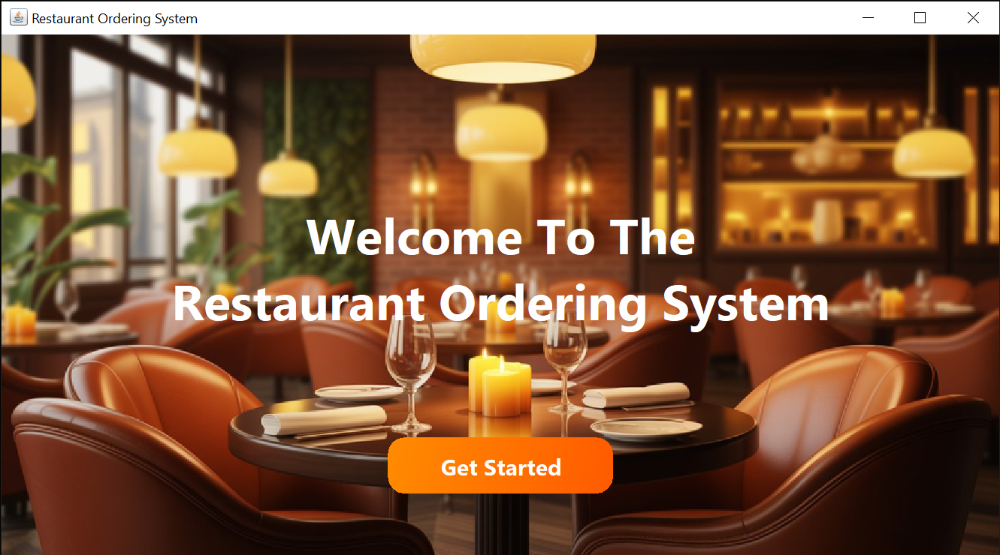
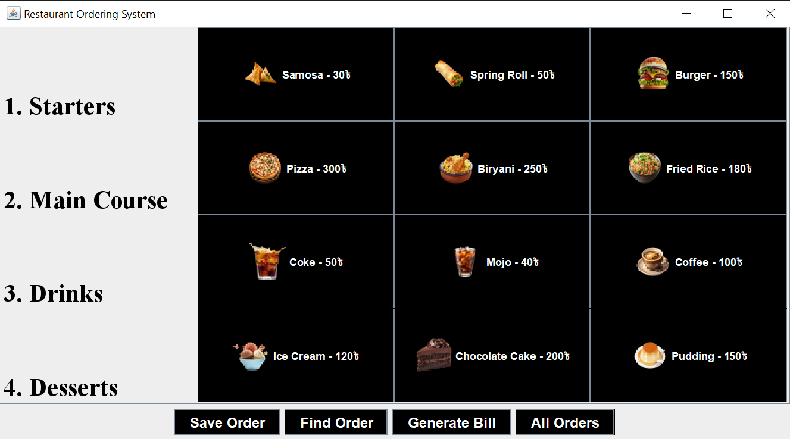

# 🍴 Restaurant Ordering System

## 📌 Project Overview

This is a simple **Restaurant Ordering System** built using **Java** and **Swing GUI** as part of the **Object-Oriented Programming with Java** course at **Premier University, Chittagong**.

The project demonstrates all **four pillars of OOP**:

* **Encapsulation**
* **Inheritance**
* **Polymorphism**
* **Abstraction**

It also includes **interface**, **abstract classes**, **exception handling**, and uses **ArrayList / HashMap** for data management.

The application allows customers' **orders to be placed, stored, and bills to be generated** in Bangladeshi currency (BDT).

---

## ✨ Features

* View and select menu items in different categories:
  * **Starters** (`StarterItem`)
  * **Main Course** (`MainCourseItem`)
  * **Drinks** (`DrinkItem`)
  * **Desserts** (`DessertItem`)
* Add items to a current order.
* Save orders in memory (`DataStore`).
* Find an order by Order ID.
* Generate and display the bill for a specific order.
* Simple GUI built with **Java Swing**.

---

## 🏗️ Project Structure

```
src/
├── DataStore.java             // Stores all orders using HashMap
├── MenuItem.java              // Abstract base class (name, price, getCategory)
├── FoodItem.java              // Inherits MenuItem, adds 'type' (Main/Dessert etc.)
├── MainCourseItem.java        // Specific FoodItem (type = "Main Course")
├── DessertItem.java           // Specific FoodItem (type = "Dessert")
├── DrinkItem.java             // Specific MenuItem (with size and Drink category)
├── StarterItem.java           // Specific FoodItem (type = "Starter")
├── Order.java                 // Handles order items, total bill, order ID, etc.
├── OrderItem.java             // Represents an individual item in an orde
├── RestaurantApp.java         // Main Swing GUI (welcome screen + order panel)
├── AllOrdersWindow.java       // Popup window to display all orders
└── BillDialog.java            // Replaces inline bill window (shows OK + Paid buttons)
```

---

## ⚙️ Installation & Run

1. Clone the repository:

   ```bash
   git clone https://github.com/rudrakaiser/Restaurant-Ordering-System
   ```

2. Go to the cloned folder:

   ```bash
   cd Restaurant-Ordering-System
   ```

3. Compile the project:

   ```bash
   javac src/*.java
   ```

4. Run the application:

   ```bash
   java src/RestaurantApp
   ```

---

## 📷 GUI Preview

### 1. Welcome Screen


### 2. Main Interface


---

## 🧑‍🤝‍🧑 Team Members

### 1. Rudra Kaiser (Project Lead)

*  Responsible for system design, major implementation, and Swing GUI integration.

### 2. Nafiz Nasim

* Assisted in testing, GUI layout adjustments, and debugging minor logic errors.

### 3. Abrar Yeasir

* Worked on class-level design, documentation support, and basic testing tasks.

---

## 📚 Technologies Used

* Java 17
* Swing (for GUI)
* HashMap & ArrayList (for data handling)

---

## 📝 License

This project is for **academic purposes only**.

---