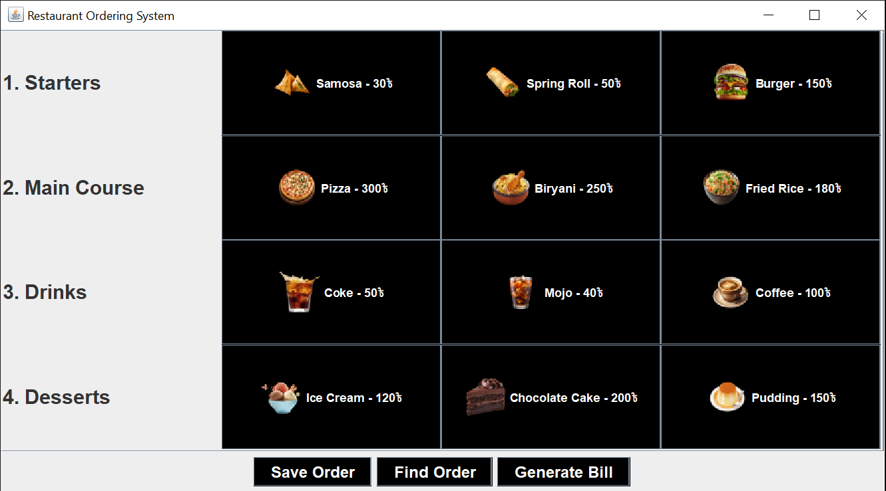

# 🍴 Restaurant Ordering System

## 📌 Project Overview

This is a simple **Restaurant Ordering System** built using **Java** and **Swing GUI** as part of the **Object-Oriented Programming with Java** course at **Premier University, Chittagong**.

The project demonstrates all **four pillars of OOP**:

* **Encapsulation**
* **Inheritance**
* **Polymorphism**
* **Abstraction**

It also includes **interface**, **abstract classes**, **exception handling**, and uses **ArrayList / HashMap** for data management.

The application allows customers' **orders to be placed, stored, and bills to be generated** in Bangladeshi currency (BDT).

---

## ✨ Features

* View and select menu items in different categories:

  * **Starters** (`StarterItem`)
  * **Main Course** (`MainCourseItem`)
  * **Drinks** (`DrinkItem`)
  * **Desserts** (`DessertItem`)
* Add items to a current order.
* Save orders in memory (`DataStore`).
* Find an order by Order ID.
* Generate and display the bill for a specific order.
* Simple GUI built with **Java Swing**.

---

## 🏗️ Project Structure

```
src/
│
├── restaurant/
│   ├── MenuItem.java        # Abstract base class
│   ├── StarterItem.java     # Inherited class
│   ├── MainCourseItem.java  # Inherited class
│   ├── DessertItem.java     # Inherited class
│   ├── OrderItem.java       # Represents an item in an order
│   ├── Order.java           # Holds multiple OrderItems
│   ├── DataStore.java       # Stores all orders (HashMap)
│   └── RestaurantApp.java   # Swing GUI main application
```

---

## ⚙️ Installation & Run

1. Clone the repository:

   ```bash
   git clone https://github.com/your-username/restaurant-management.git
   cd restaurant-management
   ```

2. Compile the project:

   ```bash
   javac src/restaurant/*.java
   ```

3. Run the application:

   ```bash
   java src/restaurant/RestaurantApp
   ```

---

## 📷 GUI Preview



---

## 🧑‍🤝‍🧑 Team Members

*  Rudra Kaiser
*  Nafiz Nasim
*  Abrar Yeasir

---

## 📚 Technologies Used

* Java 17
* Swing (for GUI)
* HashMap & ArrayList (for data handling)

---

## 📝 License

This project is for **academic purposes only**.

---